<h1 align="center">Hi 👋, I'm Pradeep Reddy</h1>
<h3 align="center">A DevOps engineer dedicated to optimizing workflows and deploying scalable applications</h3>

---
## 🚀 About Me
- 🌱 I’m building my career in **DevOps & Cloud Engineering**
- 🔧 Hands-on with **Linux, Shell Scripting, Ansible, Terraform, Jenkins, GitHub Actions, Docker, AWS, Kubernetes**
- 💡 I enjoy automating deployments, solving environment issues, and designing scalable infra
- 📚 Currently learning **Kubernetes & Advance Terraform & Docker (modules, ALB, ASG)**

---
## ⚙️ Skills Showcase

  
  
  
  
  
  
  
  
  
  

---

## 📌 Projects

### 🛒 RoboShop — End-to-End DevOps & DevSecOps

A hands-on microservices-based e-commerce application where I practiced implementing an end-to-end DevOps, DevSecOps, and GitOps workflow.

🛠️ Technology Stack

☁️ AWS • 🐧 Linux • 🐚 Shell • ⚙️ Ansible • 🏗️ Terraform • 🐳 Docker • ☸️ Kubernetes • ☁️ Amazon EKS • 🔨 Jenkins • 🚀 GitHub Actions • 🔐 SonarQube • 🛡️ Trivy • 🔄 Argo CD • 📊 Prometheus • 📈 Grafana • 📋 ELK

🔄 End-to-End Workflow

Git → 🔄 CI/CD → 🔎 SonarQube → ✅ Quality Gate → 🛡️ Trivy → 🐳 Docker → ☸️ Kubernetes/EKS → 🚀 Argo CD → 📊 Monitoring → 📋 Logging

📌 Project Implementation

* 🐚 Automated RoboShop component installation and configuration using Bash/Shell scripting
* ⚙️ Automated Linux server configuration using Ansible playbooks and reusable roles
* 🏗️ Provisioned AWS infrastructure using Terraform
* 🧩 Created reusable Terraform configurations and modules
* 🐳 Containerized RoboShop microservices using Docker
* ☸️ Deployed microservices on Kubernetes and Amazon EKS
* ⚙️ Configured Kubernetes Deployments, Services, ConfigMaps, Secrets, Ingress, RBAC, and storage
* ⛵ Practiced Helm-based Kubernetes deployments
* 📈 Practiced Kubernetes scaling, scheduling, and deployment strategies
* 🔄 Built CI/CD pipelines using Jenkins and GitHub Actions
* 🔨 Practiced Jenkins pipelines, agents, multibranch pipelines, and shared libraries
* 🔎 Integrated SonarQube for static code analysis and quality gates
* 🛡️ Integrated Trivy for container image vulnerability scanning
* 🔐 Practiced DevSecOps by integrating security checks into CI/CD
* 🚀 Implemented GitOps deployment concepts using Argo CD
* 📊 Monitored infrastructure and applications using Prometheus and Grafana
* 🚨 Configured Node Exporter and Alertmanager for monitoring and alerting
* 📋 Implemented centralized logging using Elasticsearch, Logstash, Kibana, and Filebeat
* 🧠 Practiced troubleshooting across Linux, AWS, Terraform, Docker, Kubernetes, EKS, CI/CD, and application deployments

🎯 Key Skills Demonstrated

🐧 Linux Administration • 🐚 Shell Scripting • ☁️ AWS • 🏗️ Terraform • ⚙️ Ansible • 🐳 Docker • ☸️ Kubernetes • ☁️ Amazon EKS • 🔨 Jenkins • 🚀 GitHub Actions • 🔐 DevSecOps • 🔎 SonarQube • 🛡️ Trivy • 🔄 Argo CD • 📊 Prometheus • 📈 Grafana • 📋 ELK • 🔄 GitOps • 🚀 CI/CD • ☁️ Cloud Automation • 🧠 Troubleshooting

⸻

☁️ AWS Cloud Projects

🏗️ Capstone Project 1 — Scalable Web Application on AWS

Built and practiced a scalable web application architecture using AWS services, focusing on cloud infrastructure, application scalability, networking, and high availability.

🛠️ AWS Services

☁️ Amazon EC2 • 🌐 Amazon VPC • 🪣 Amazon S3 • ⚖️ Elastic Load Balancing • 📈 Auto Scaling • 🔐 IAM

📌 Project Highlights

* 🏗️ Designed a scalable AWS application architecture
* 💻 Configured compute resources using EC2
* 🌐 Worked with VPC networking and AWS infrastructure
* 🪣 Used S3 for cloud storage
* ⚖️ Configured load balancing for application traffic
* 📈 Practiced Auto Scaling for application capacity
* 🔐 Applied IAM for access control and AWS resource security

⸻

⚡ Mini Capstone Project — Auto Scaling Deep Dive

Practiced building a highly available and scalable web application using EC2, Application Load Balancer, EFS, Launch Template, Auto Scaling, and CloudWatch.

🛠️ AWS Services

💻 EC2 • ⚖️ ALB • 📁 EFS • 📋 Launch Template • 📈 Auto Scaling • 📊 CloudWatch

📌 Project Highlights

* 💻 Created EC2 instances for the web application
* ⚖️ Configured an Application Load Balancer
* 🎯 Created and configured Target Groups
* 📋 Used Launch Templates for standardized EC2 configuration
* 📈 Configured Auto Scaling for dynamic instance management
* 📁 Used EFS as shared storage across EC2 instances
* 📊 Configured CloudWatch monitoring
* ❤️‍🩹 Practiced health checks and load balancing
* 🔄 Tested scaling behavior and application availability
* 🧠 Troubleshot EC2, ALB, EFS, Auto Scaling, and CloudWatch configurations

⸻

📸 Capstone Project 2 — Serverless Scalable Photo Sharing Application

Built and practiced a serverless and scalable photo-sharing application using managed AWS services.

🛠️ AWS Services

🪣 Amazon S3 • 🗄️ DynamoDB • 🔐 Amazon Cognito • 🌐 API Gateway • ⚡ AWS Lambda

📌 Project Highlights

* 🪣 Used S3 for scalable object and photo storage
* ⚡ Used Lambda for serverless application logic
* 🌐 Configured API Gateway for application APIs
* 🗄️ Used DynamoDB for NoSQL database operations
* 🔐 Configured Cognito for user authentication
* 🔄 Practiced event-driven and serverless architecture concepts
* ☁️ Worked with AWS managed services to reduce infrastructure management
* 📈 Practiced designing scalable cloud-native application components

## 📫 Connect With Me  
📧 **Email:** *prem.pradeepreddy@gmail.com*  
🔗 **LinkedIn:** www.linkedin.com/in/pradeep-reddy-938809305 
🔗 **GitHub:** https://github.com/PradeepReddy927

---

## 📊 GitHub Stats

  

---
<picture>
  <source media="(prefers-color-scheme: dark)" srcset="https://raw.githubusercontent.com/abozanona/abozanona/output/pacman-contribution-graph-dark.svg">
  <source media="(prefers-color-scheme: light)" srcset="https://raw.githubusercontent.com/abozanona/abozanona/output/pacman-contribution-graph.svg">
  
</picture>

